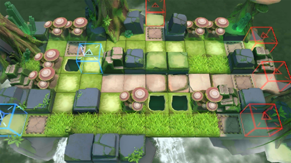

# 关卡一览————RI-EX-7

## 关卡一览

关卡编号: RI-EX-7

关卡名称: 松软地形

目标点生命值: 3

敌人总数: 51

理智消耗: 20

## 关卡地图

## 敌人情况

| 敌人图片 | 敌人名称 | 数量  |
|---------|-----|-----|
| ./eneIcons/eneIcons/ÌáÑÇ¿¨ÎÚ´óÎ×.png| 提亚卡乌大巫  |   4  |
| ./eneIcons/eneIcons/ÌáÑÇ¿¨ÎÚ¹Ú¾ü.png| 提亚卡乌冠军  |   4  |
| ./eneIcons/eneIcons/ÌáÑÇ¿¨ÎÚÆÆ»µÍõ.png| 提亚卡乌破坏王  |   4  |
| ./eneIcons/eneIcons/ÌáÑÇ¿¨ÎÚÉñͶÊÖ.png| 提亚卡乌神投手  |   5  |
| ./eneIcons/eneIcons/ÌáÑÇ¿¨ÎÚ˺ÁÑÕß.png| 提亚卡乌撕裂者  |   7  |
| ./eneIcons/eneIcons/ÌáÑÇ¿¨ÎÚÎÀÊ¿.png| 提亚卡乌卫士  |   27  |
