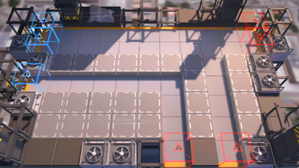

# 关卡一览————S2-11

## 关卡一览

关卡编号: S2-11

关卡名称: 窒息-2

目标点生命值: 3

敌人总数: 48

理智消耗: 12

## 关卡地图

## 敌人情况

| 敌人图片 | 敌人名称 | 数量  |
|---------|-----|-----|
| ./eneIcons/eneIcons/±©ÂÒ·Ö×Ó.png| 暴乱分子  |   4  |
| ./eneIcons/eneIcons/±©Í½.png| 暴徒  |   11  |
| ./eneIcons/eneIcons/¸ß½×Êõʦ.png| 高阶术师  |   3  |
| ./eneIcons/eneIcons/»ú¶¯¶Ü±ø.png| 机动盾兵  |   5  |
| ./eneIcons/eneIcons/¼¦Î²¾ÆͶÖÀÕß.png| 鸡尾酒投掷者  |   13  |
| ./eneIcons/eneIcons/ȼÉÕƿͶÖÀÕß.png| 燃烧瓶投掷者  |   4  |
| ./eneIcons/eneIcons/Ê°»ÄÕß.png| 拾荒者  |   5  |
| ./eneIcons/eneIcons/Êõʦ.png| 术师  |   3  |
