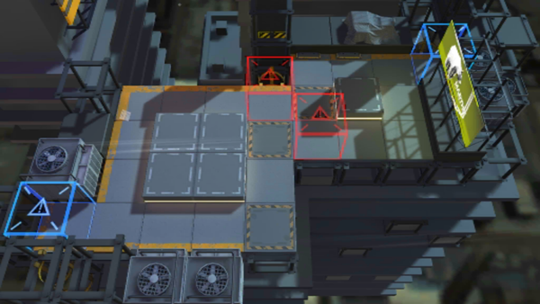

# 关卡一览————S2-12

## 关卡一览

关卡编号: S2-12

关卡名称: 窒息-3

目标点生命值: 3

敌人总数: 48

理智消耗: 15

## 关卡地图

## 敌人情况

| 敌人图片 | 敌人名称 | 数量  |
|---------|-----|-----|
| ./eneIcons/eneIcons/¸ß½×Êõʦ.png| 高阶术师  |   2  |
| ./eneIcons/eneIcons/Çá¼×ÎÀ±ø.png| 轻甲卫兵  |   7  |
| ./eneIcons/eneIcons/Ê¿±ø.png| 士兵  |   5  |
| ./eneIcons/eneIcons/Êõʦ.png| 术师  |   3  |
| ./eneIcons/eneIcons/Ë«³Ö½£Ê¿×鳤.png| 双持剑士组长  |   4  |
| ./eneIcons/eneIcons/Ñý¹Ö.png| 妖怪  |   21  |
| ./eneIcons/eneIcons/Ñý¹ÖMKII.png| 妖怪MKII  |   6  |
