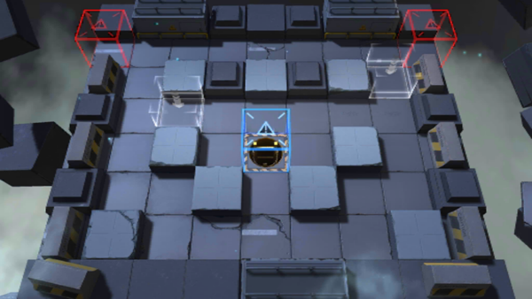

# 关卡一览————S2-3

## 关卡一览

关卡编号: S2-3

关卡名称: 封锁-1

目标点生命值: 5

敌人总数: 72

理智消耗: 9

## 关卡地图

## 敌人情况

| 敌人图片 | 敌人名称 | 数量  |
|---------|-----|-----|
| ./eneIcons/eneIcons/·¥Ä¾»ú.png| 伐木机  |   2  |
| ./eneIcons/eneIcons/¼¦Î²¾ÆͶÖÀÕß.png| 鸡尾酒投掷者  |   3  |
| ./eneIcons/eneIcons/ÁÔ¹·pro.png| 猎狗pro  |   4  |
| ./eneIcons/eneIcons/Ë«³Ö½£Ê¿.png| 双持剑士  |   9  |
| ./eneIcons/eneIcons/Դʯ³æ¡¤¦Á.png| 源石虫·α  |   54  |
