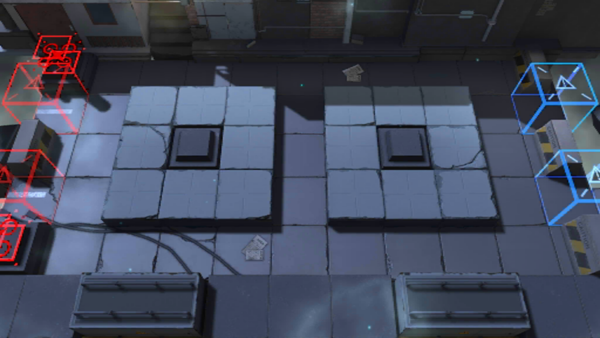

# 关卡一览————S2-6

## 关卡一览

关卡编号: S2-6

关卡名称: 术师-2

目标点生命值: 5

敌人总数: 40

理智消耗: 12

## 关卡地图

## 敌人情况

| 敌人图片 | 敌人名称 | 数量  |
|---------|-----|-----|
| ./eneIcons/eneIcons/±©Í½.png| 暴徒  |   20  |
| ./eneIcons/eneIcons/·¥Ä¾»ú.png| 伐木机  |   2  |
| ./eneIcons/eneIcons/¸ß½×Êõʦ.png| 高阶术师  |   2  |
| ./eneIcons/eneIcons/ÁÔ¹·pro.png| 猎狗pro  |   6  |
| ./eneIcons/eneIcons/Ê°»ÄÕß.png| 拾荒者  |   4  |
| ./eneIcons/eneIcons/Êõʦ.png| 术师  |   6  |
