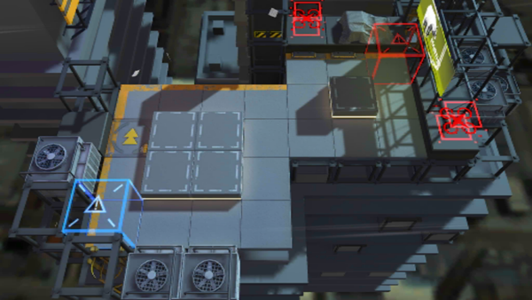

# 关卡一览————S2-9

## 关卡一览

关卡编号: S2-9

关卡名称: 陷阱-2

目标点生命值: 3

敌人总数: 32

理智消耗: 12

## 关卡地图

## 敌人情况

| 敌人图片 | 敌人名称 | 数量  |
|---------|-----|-----|
| ./eneIcons/eneIcons/±©ÂÒ·Ö×Ó.png| 暴乱分子  |   11  |
| ./eneIcons/eneIcons/¸ß½×Êõʦ.png| 高阶术师  |   1  |
| ./eneIcons/eneIcons/ÁÔ¹·pro.png| 猎狗pro  |   2  |
| ./eneIcons/eneIcons/ÅÍз.png| 磐蟹  |   2  |
| ./eneIcons/eneIcons/Êõʦ×鳤.png| 术师组长  |   6  |
| ./eneIcons/eneIcons/Ë«³Ö½£Ê¿×鳤.png| 双持剑士组长  |   2  |
| ./eneIcons/eneIcons/Ñý¹Ö.png| 妖怪  |   8  |
