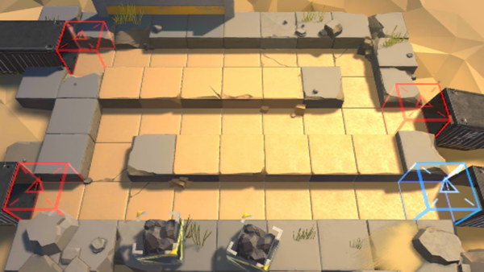

# 关卡一览————S3-1

## 关卡一览

关卡编号: S3-1

关卡名称: 潜伏-1

目标点生命值: 3

敌人总数: 30

理智消耗: 15

## 关卡地图

## 敌人情况

| 敌人图片 | 敌人名称 | 数量  |
|---------|-----|-----|
| ./eneIcons/eneIcons/ÁÔ¹·pro.png| 猎狗pro  |   3  |
| ./eneIcons/eneIcons/DZ·üÕß.png| 潜伏者  |   13  |
| ./eneIcons/eneIcons/Ê°»ÄÕß.png| 拾荒者  |   4  |
| ./eneIcons/eneIcons/Êõʦ×鳤.png| 术师组长  |   4  |
| ./eneIcons/eneIcons/ÍÀ·ò.png| 屠夫  |   1  |
| ./eneIcons/eneIcons/ÒþÐÎåóÊÖ.png| 隐形弩手  |   5  |
