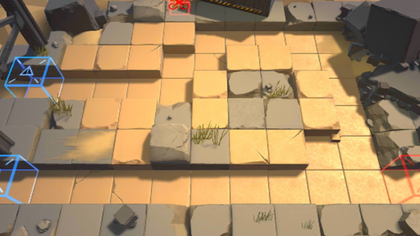

# 关卡一览————S3-2

## 关卡一览

关卡编号: S3-2

关卡名称: 潜伏-2

目标点生命值: 3

敌人总数: 70

理智消耗: 15

## 关卡地图

## 敌人情况

| 敌人图片 | 敌人名称 | 数量  |
|---------|-----|-----|
| ./eneIcons/eneIcons/¸ß½×Êõʦ.png| 高阶术师  |   1  |
| ./eneIcons/eneIcons/DZ·üÕß.png| 潜伏者  |   10  |
| ./eneIcons/eneIcons/Ê°»ÄÕß.png| 拾荒者  |   2  |
| ./eneIcons/eneIcons/Êõʦ×鳤.png| 术师组长  |   1  |
| ./eneIcons/eneIcons/Ë«³Ö½£Ê¿×鳤.png| 双持剑士组长  |   4  |
| ./eneIcons/eneIcons/ÍÀ·ò.png| 屠夫  |   1  |
| ./eneIcons/eneIcons/Ñý¹Ö.png| 妖怪  |   2  |
| ./eneIcons/eneIcons/Ñý¹ÖMKII.png| 妖怪MKII  |   8  |
| ./eneIcons/eneIcons/ÒþÐÎåóÊÖ.png| 隐形弩手  |   8  |
| ./eneIcons/eneIcons/Դʯ³æ¡¤¦Â.png| 源石虫·β  |   33  |
