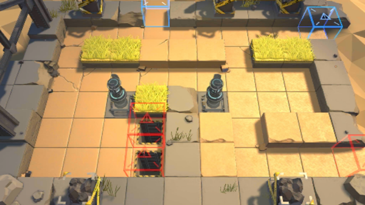

# 关卡一览————S3-3

## 关卡一览

关卡编号: S3-3

关卡名称: 侦察-1

目标点生命值: 3

敌人总数: 64

理智消耗: 15

## 关卡地图

## 敌人情况

| 敌人图片 | 敌人名称 | 数量  |
|---------|-----|-----|
| ./eneIcons/eneIcons/±©ÂÒ·Ö×Ó.png| 暴乱分子  |   13  |
| ./eneIcons/eneIcons/¿ñ±©µÄÁÔ¹·pro.png| 狂暴的猎狗pro  |   9  |
| ./eneIcons/eneIcons/ÁÔ¹·pro.png| 猎狗pro  |   11  |
| ./eneIcons/eneIcons/DZ·üÕß.png| 潜伏者  |   8  |
| ./eneIcons/eneIcons/Ê°»ÄÕß.png| 拾荒者  |   4  |
| ./eneIcons/eneIcons/ÒþÐÎåóÊÖ.png| 隐形弩手  |   8  |
| ./eneIcons/eneIcons/ÒþÐÎÊõʦ.png| 隐形术师  |   5  |
| ./eneIcons/eneIcons/Դʯ³æ¡¤¦Â.png| 源石虫·β  |   6  |
