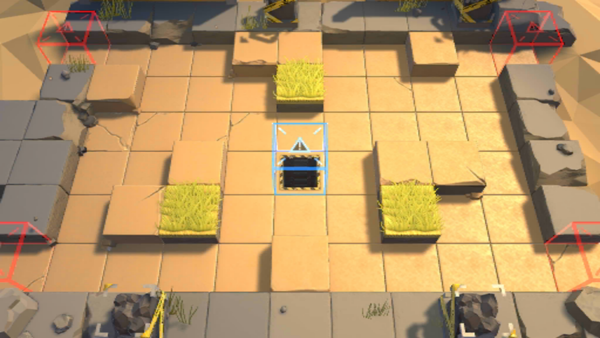

# 关卡一览————S3-4

## 关卡一览

关卡编号: S3-4

关卡名称: 侦察-2

目标点生命值: 3

敌人总数: 42

理智消耗: 15

## 关卡地图

## 敌人情况

| 敌人图片 | 敌人名称 | 数量  |
|---------|-----|-----|
| ./eneIcons/eneIcons/±©ÂÒ·Ö×Ó.png| 暴乱分子  |   6  |
| ./eneIcons/eneIcons/DZ·üÕß.png| 潜伏者  |   11  |
| ./eneIcons/eneIcons/ȼÉÕƿͶÖÀÕß.png| 燃烧瓶投掷者  |   2  |
| ./eneIcons/eneIcons/Ê°»ÄÕß.png| 拾荒者  |   2  |
| ./eneIcons/eneIcons/Ë«³Ö½£Ê¿×鳤.png| 双持剑士组长  |   6  |
| ./eneIcons/eneIcons/ÍÀ·ò.png| 屠夫  |   2  |
| ./eneIcons/eneIcons/ÒþÐÎåóÊÖ.png| 隐形弩手  |   6  |
| ./eneIcons/eneIcons/ÒþÐÎÊõʦ.png| 隐形术师  |   7  |
