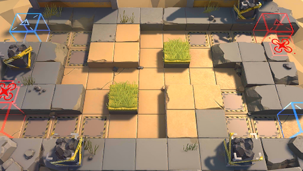

# 关卡一览————S3-7

## 关卡一览

关卡编号: S3-7

关卡名称: 隐匿-1

目标点生命值: 3

敌人总数: 72

理智消耗: 18

## 关卡地图

## 敌人情况

| 敌人图片 | 敌人名称 | 数量  |
|---------|-----|-----|
| ./eneIcons/eneIcons/DZ·üÕß.png| 潜伏者  |   14  |
| ./eneIcons/eneIcons/Ñý¹ÖMKII.png| 妖怪MKII  |   16  |
| ./eneIcons/eneIcons/ÒþÐÎåóÊÖ.png| 隐形弩手  |   9  |
| ./eneIcons/eneIcons/ÒþÐÎÊõʦ.png| 隐形术师  |   9  |
| ./eneIcons/eneIcons/Դʯ³æ¡¤¦Â.png| 源石虫·β  |   24  |
