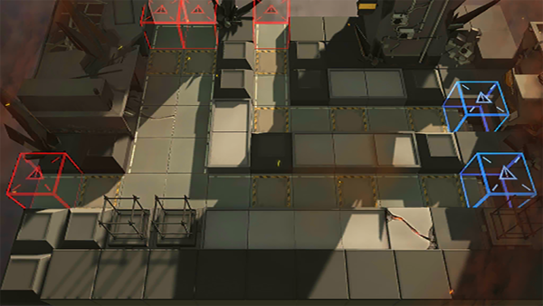

# 关卡一览————S4-10

## 关卡一览

关卡编号: S4-10

关卡名称: 坚守-1

目标点生命值: 15

敌人总数: 47

理智消耗: 18

## 关卡地图

## 敌人情况

| 敌人图片 | 敌人名称 | 数量  |
|---------|-----|-----|
| ./eneIcons/eneIcons/·¨Êõ½üÎÀ.png| 法术近卫  |   7  |
| ./eneIcons/eneIcons/ÁÔ¹·pro.png| 猎狗pro  |   15  |
| ./eneIcons/eneIcons/Èø¿¨×È´ó½£ÊÖ.png| 萨卡兹大剑手  |   6  |
| ./eneIcons/eneIcons/Èø¿¨×Ⱦѻ÷ÊÖ.png| 萨卡兹狙击手  |   3  |
| ./eneIcons/eneIcons/Èø¿¨×ÈÊõʦ.png| 萨卡兹术师  |   3  |
| ./eneIcons/eneIcons/Դʯ³æ¡¤¦Â.png| 源石虫·β  |   13  |
