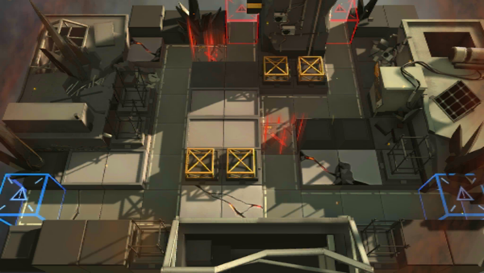

# 关卡一览————S4-3

## 关卡一览

关卡编号: S4-3

关卡名称: 晶簇-3

目标点生命值: 3

敌人总数: 40

理智消耗: 18

## 关卡地图

## 敌人情况

| 敌人图片 | 敌人名称 | 数量  |
|---------|-----|-----|
| ./eneIcons/eneIcons/ÁÔ¹·pro.png| 猎狗pro  |   9  |
| ./eneIcons/eneIcons/Çá¼×ÎÀ±ø.png| 轻甲卫兵  |   7  |
| ./eneIcons/eneIcons/Èø¿¨×È´ó½£ÊÖ.png| 萨卡兹大剑手  |   7  |
| ./eneIcons/eneIcons/Èø¿¨×Ⱦѻ÷ÊÖ.png| 萨卡兹狙击手  |   5  |
| ./eneIcons/eneIcons/Ê¿±ø.png| 士兵  |   9  |
| ./eneIcons/eneIcons/Êõʦ×鳤.png| 术师组长  |   3  |
