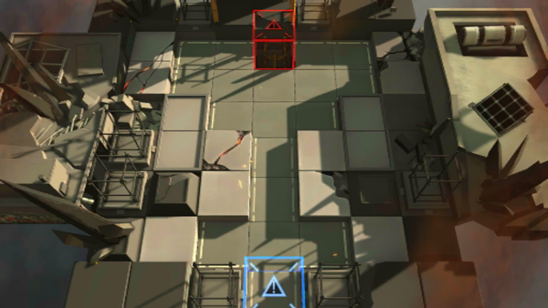

# 关卡一览————S4-5

## 关卡一览

关卡编号: S4-5

关卡名称: 多足-2

目标点生命值: 3

敌人总数: 75

理智消耗: 18

## 关卡地图

## 敌人情况

| 敌人图片 | 敌人名称 | 数量  |
|---------|-----|-----|
| ./eneIcons/eneIcons/¸ßÄÜԴʯ³æ.png| 高能源石虫  |   17  |
| ./eneIcons/eneIcons/Èø¿¨×È´ó½£ÊÖ.png| 萨卡兹大剑手  |   2  |
| ./eneIcons/eneIcons/Êõʦ×鳤.png| 术师组长  |   3  |
| ./eneIcons/eneIcons/Ë«³Ö½£Ê¿×鳤.png| 双持剑士组长  |   2  |
| ./eneIcons/eneIcons/Ñý¹ÖMKII.png| 妖怪MKII  |   8  |
| ./eneIcons/eneIcons/Դʯ³æ¡¤¦Â.png| 源石虫·β  |   43  |
