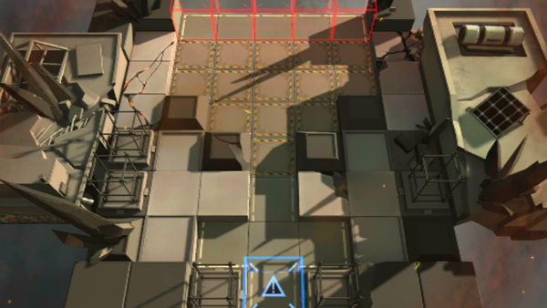

# 关卡一览————S4-6

## 关卡一览

关卡编号: S4-6

关卡名称: 多足-3

目标点生命值: 3

敌人总数: 47

理智消耗: 21

## 关卡地图

## 敌人情况

| 敌人图片 | 敌人名称 | 数量  |
|---------|-----|-----|
| ./eneIcons/eneIcons/±©ÂÒ·Ö×Ó.png| 暴乱分子  |   9  |
| ./eneIcons/eneIcons/·¨Êõ½üÎÀ.png| 法术近卫  |   4  |
| ./eneIcons/eneIcons/¸ßÄÜԴʯ³æ.png| 高能源石虫  |   23  |
| ./eneIcons/eneIcons/åóÊÖ×鳤.png| 弩手组长  |   4  |
| ./eneIcons/eneIcons/È­ÈÐÎäÊ¿.png| 拳刃武士  |   3  |
| ./eneIcons/eneIcons/Èø¿¨×È´ó½£ÊÖ.png| 萨卡兹大剑手  |   2  |
| ./eneIcons/eneIcons/ÖØ×°·ÀÓù×鳤.png| 重装防御组长  |   2  |
