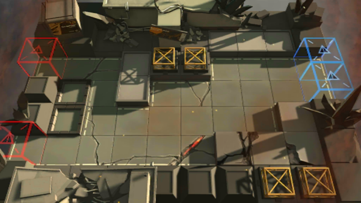

# 关卡一览————S4-8

## 关卡一览

关卡编号: S4-8

关卡名称: 狂怒-2

目标点生命值: 3

敌人总数: 47

理智消耗: 18

## 关卡地图

## 敌人情况

| 敌人图片 | 敌人名称 | 数量  |
|---------|-----|-----|
| ./eneIcons/eneIcons/±©ÂÒ·Ö×Ó.png| 暴乱分子  |   7  |
| ./eneIcons/eneIcons/·¨Êõ½üÎÀ.png| 法术近卫  |   6  |
| ./eneIcons/eneIcons/¸ßÄÜԴʯ³æ.png| 高能源石虫  |   14  |
| ./eneIcons/eneIcons/ÁÔ¹·.png| 猎狗  |   6  |
| ./eneIcons/eneIcons/ȼÉÕƿͶÖÀÕß.png| 燃烧瓶投掷者  |   4  |
| ./eneIcons/eneIcons/Èø¿¨×È´ó½£ÊÖ.png| 萨卡兹大剑手  |   4  |
| ./eneIcons/eneIcons/Èø¿¨×Ⱦѻ÷ÊÖ.png| 萨卡兹狙击手  |   4  |
| ./eneIcons/eneIcons/Èø¿¨×ÈÊõʦ.png| 萨卡兹术师  |   2  |
