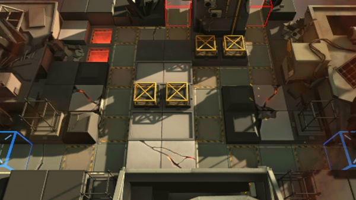

# 关卡一览————S4-9

## 关卡一览

关卡编号: S4-9

关卡名称: 狂怒-3

目标点生命值: 3

敌人总数: 50

理智消耗: 21

## 关卡地图

## 敌人情况

| 敌人图片 | 敌人名称 | 数量  |
|---------|-----|-----|
| ./eneIcons/eneIcons/·¨Êõ½üÎÀ.png| 法术近卫  |   24  |
| ./eneIcons/eneIcons/ÅÍз.png| 磐蟹  |   1  |
| ./eneIcons/eneIcons/Çá¼×ÎÀ±ø×鳤.png| 轻甲卫兵组长  |   12  |
| ./eneIcons/eneIcons/Èø¿¨×È´ó½£ÊÖ.png| 萨卡兹大剑手  |   5  |
| ./eneIcons/eneIcons/Èø¿¨×ÈÊõʦ.png| 萨卡兹术师  |   2  |
| ./eneIcons/eneIcons/Ñý¹ÖMKII.png| 妖怪MKII  |   6  |
