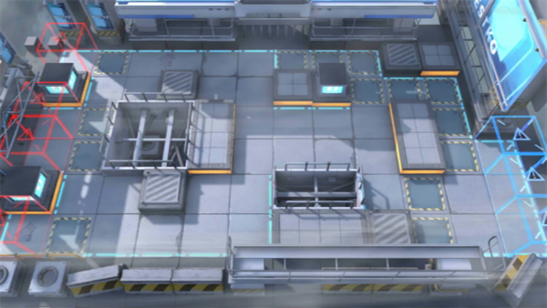

# 关卡一览————S5-1

## 关卡一览

关卡编号: S5-1

关卡名称: 盘踞-1

目标点生命值: 3

敌人总数: 49

理智消耗: 18

## 关卡地图

## 敌人情况

| 敌人图片 | 敌人名称 | 数量  |
|---------|-----|-----|
| ./eneIcons/eneIcons/·¥Ä¾ÀÏÊÖ.png| 伐木老手  |   2  |
| ./eneIcons/eneIcons/ÁÔ¹·pro.png| 猎狗pro  |   5  |
| ./eneIcons/eneIcons/ÆÆÕóÕß.png| 破阵者  |   17  |
| ./eneIcons/eneIcons/ÌØսʿ±ø.png| 特战士兵  |   18  |
| ./eneIcons/eneIcons/ÌØÕ½Êõʦ.png| 特战术师  |   2  |
| ./eneIcons/eneIcons/ÌØÕ½Êõʦ×鳤.png| 特战术师组长  |   2  |
| ./eneIcons/eneIcons/ÓÄÁé.png| 幽灵  |   3  |
