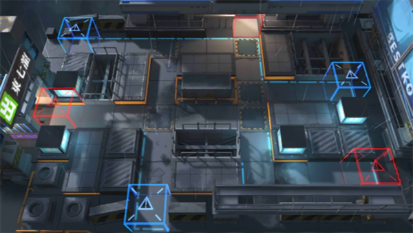

# 关卡一览————S5-2

## 关卡一览

关卡编号: S5-2

关卡名称: 盘踞-2

目标点生命值: 3

敌人总数: 48

理智消耗: 18

## 关卡地图

## 敌人情况

| 敌人图片 | 敌人名称 | 数量  |
|---------|-----|-----|
| ./eneIcons/eneIcons/·¥Ä¾»ú.png| 伐木机  |   3  |
| ./eneIcons/eneIcons/ÆÆÕóÕß.png| 破阵者  |   12  |
| ./eneIcons/eneIcons/ÆÆÕóÕß×鳤.png| 破阵者组长  |   6  |
| ./eneIcons/eneIcons/ÌØսʿ±ø.png| 特战士兵  |   20  |
| ./eneIcons/eneIcons/ÌØÕ½Êõʦ.png| 特战术师  |   4  |
| ./eneIcons/eneIcons/ÌØÕ½Êõʦ×鳤.png| 特战术师组长  |   3  |
