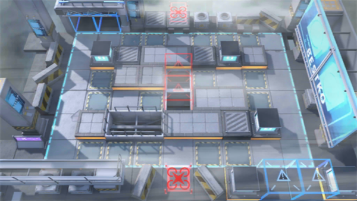

# 关卡一览————S5-4

## 关卡一览

关卡编号: S5-4

关卡名称: 恶寒-2

目标点生命值: 3

敌人总数: 58

理智消耗: 18

## 关卡地图

## 敌人情况

| 敌人图片 | 敌人名称 | 数量  |
|---------|-----|-----|
| ./eneIcons/eneIcons/·¨Êõ´óʦA1.png| 法术大师A1  |   14  |
| ./eneIcons/eneIcons/º®Ëª.png| 寒霜  |   4  |
| ./eneIcons/eneIcons/ÌØսʿ±ø.png| 特战士兵  |   32  |
| ./eneIcons/eneIcons/Ñý¹Ö.png| 妖怪  |   8  |
