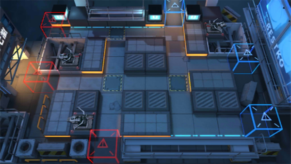

# 关卡一览————S5-6

## 关卡一览

关卡编号: S5-6

关卡名称: 恐慌-2

目标点生命值: 3

敌人总数: 41

理智消耗: 18

## 关卡地图

## 敌人情况

| 敌人图片 | 敌人名称 | 数量  |
|---------|-----|-----|
| ./eneIcons/eneIcons/·ÛËé¹¥¼áÊÖ.png| 粉碎攻坚手  |   2  |
| ./eneIcons/eneIcons/ËÞÖ÷Ê°»ÄÕß.png| 宿主拾荒者  |   5  |
| ./eneIcons/eneIcons/ËÞÖ÷Ê¿±ø.png| 宿主士兵  |   16  |
| ./eneIcons/eneIcons/ÌØսʿ±ø.png| 特战士兵  |   10  |
| ./eneIcons/eneIcons/ÌØÕ½Êõʦ.png| 特战术师  |   8  |
