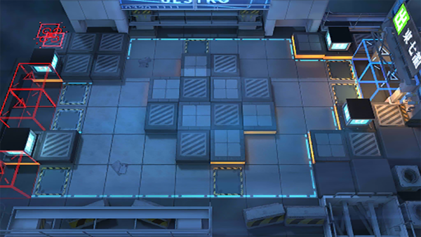

# 关卡一览————S5-7

## 关卡一览

关卡编号: S5-7

关卡名称: 盘旋-1

目标点生命值: 3

敌人总数: 57

理智消耗: 18

## 关卡地图

## 敌人情况

| 敌人图片 | 敌人名称 | 数量  |
|---------|-----|-----|
| ./eneIcons/eneIcons/±©û_¡¤G.png| 暴鸰·G  |   4  |
| ./eneIcons/eneIcons/·¨Êõ´óʦA1.png| 法术大师A1  |   12  |
| ./eneIcons/eneIcons/º®Ëª.png| 寒霜  |   2  |
| ./eneIcons/eneIcons/ËÞÖ÷Ê¿±ø.png| 宿主士兵  |   22  |
| ./eneIcons/eneIcons/Դʯ³æ¡¤¦Â.png| 源石虫·β  |   17  |
