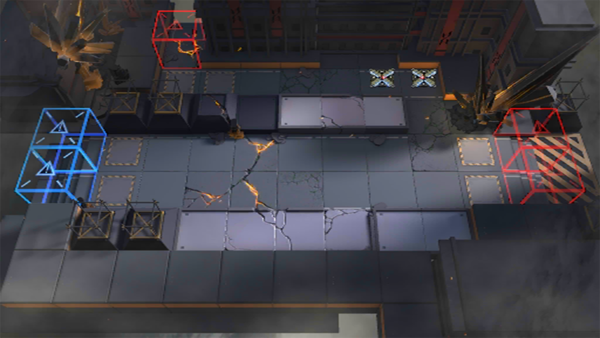

# 关卡一览————S7-1

## 关卡一览

关卡编号: S7-1

关卡名称: 埋伏-1

目标点生命值: 3

敌人总数: 32

理智消耗: 18

## 关卡地图

## 敌人情况

| 敌人图片 | 敌人名称 | 数量  |
|---------|-----|-----|
| ./eneIcons/eneIcons/Óλ÷¶Ó´«Áî±ø.png| 游击队传令兵  |   2  |
| ./eneIcons/eneIcons/Óλ÷¶Ó¶ÜÎÀ×鳤.png| 游击队盾卫组长  |   2  |
| ./eneIcons/eneIcons/Óλ÷¶ÓÁÔÈ®.png| 游击队猎犬  |   13  |
| ./eneIcons/eneIcons/Óλ÷¶ÓÆÈ»÷ÅÚ±ø.png| 游击队迫击炮兵  |   2  |
| ./eneIcons/eneIcons/Óλ÷¶Óսʿ.png| 游击队战士  |   13  |
