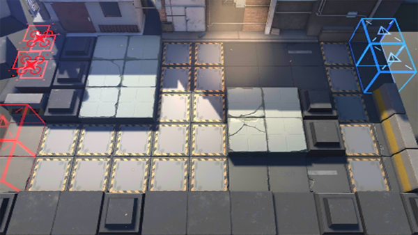

# 关卡一览————SA-1

## 关卡一览

关卡编号: SA-1

关卡名称: 捷径

目标点生命值: 5

敌人总数: 38

理智消耗: 6

## 关卡地图

## 敌人情况

| 敌人图片 | 敌人名称 | 数量  |
|---------|-----|-----|
| ./eneIcons/eneIcons/·¥Ä¾»ú.png| 伐木机  |   3  |
| ./eneIcons/eneIcons/Çá¼×ÎÀ±ø.png| 轻甲卫兵  |   5  |
| ./eneIcons/eneIcons/ȼÉÕƿͶÖÀÕß.png| 燃烧瓶投掷者  |   11  |
| ./eneIcons/eneIcons/Ê¿±ø.png| 士兵  |   5  |
| ./eneIcons/eneIcons/Ë«³Ö½£Ê¿.png| 双持剑士  |   5  |
| ./eneIcons/eneIcons/Ñý¹Ö.png| 妖怪  |   8  |
| ./eneIcons/eneIcons/Óù4.png| 御4  |   1  |
