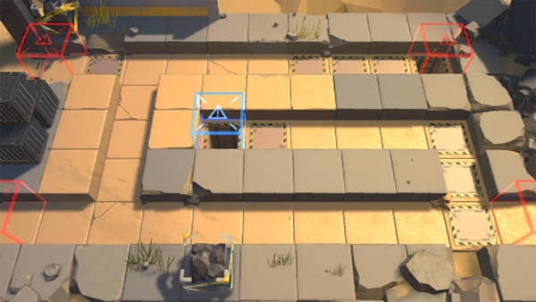

# 关卡一览————SA-2

## 关卡一览

关卡编号: SA-2

关卡名称: 交叉口

目标点生命值: 3

敌人总数: 42

理智消耗: 9

## 关卡地图

## 敌人情况

| 敌人图片 | 敌人名称 | 数量  |
|---------|-----|-----|
| ./eneIcons/eneIcons/DZ·üÕß.png| 潜伏者  |   29  |
| ./eneIcons/eneIcons/Èø¿¨×È°Ù·ò³¤.png| 萨卡兹百夫长  |   1  |
| ./eneIcons/eneIcons/ÒþÐÎåóÊÖ.png| 隐形弩手  |   8  |
| ./eneIcons/eneIcons/ÒþÐÎÊõʦ.png| 隐形术师  |   4  |
