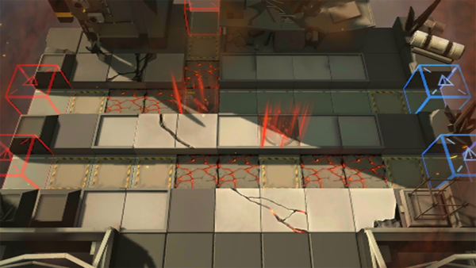

# 关卡一览————SA-3

## 关卡一览

关卡编号: SA-3

关卡名称: 峡道

目标点生命值: 3

敌人总数: 50

理智消耗: 12

## 关卡地图

## 敌人情况

| 敌人图片 | 敌人名称 | 数量  |
|---------|-----|-----|
| ./eneIcons/eneIcons/¸´³ðÕß.png| 复仇者  |   2  |
| ./eneIcons/eneIcons/»ú¶¯¶Ü±ø.png| 机动盾兵  |   9  |
| ./eneIcons/eneIcons/¾«¸É´òÊÖ.png| 精干打手  |   9  |
| ./eneIcons/eneIcons/¿ñ±©µÄÁÔ¹·pro.png| 狂暴的猎狗pro  |   11  |
| ./eneIcons/eneIcons/ÅÚÊÖ.png| 炮手  |   5  |
| ./eneIcons/eneIcons/Èø¿¨×È´ó½£ÊÖ.png| 萨卡兹大剑手  |   7  |
| ./eneIcons/eneIcons/Èø¿¨×Ⱦѻ÷ÊÖ.png| 萨卡兹狙击手  |   7  |
