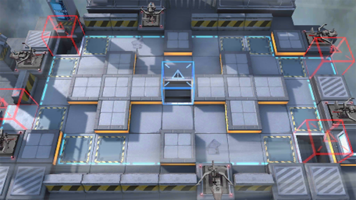

# 关卡一览————SA-4

## 关卡一览

关卡编号: SA-4

关卡名称: 四面楚歌

目标点生命值: 3

敌人总数: 36

理智消耗: 15

## 关卡地图

## 敌人情况

| 敌人图片 | 敌人名称 | 数量  |
|---------|-----|-----|
| ./eneIcons/eneIcons/·ÛËé¹¥¼á×鳤.png| 粉碎攻坚组长  |   2  |
| ./eneIcons/eneIcons/ÆÆÕóÕß.png| 破阵者  |   14  |
| ./eneIcons/eneIcons/ÌØսʿ±ø.png| 特战士兵  |   8  |
| ./eneIcons/eneIcons/ÌØÕ½Êõʦ.png| 特战术师  |   6  |
| ./eneIcons/eneIcons/ÌØÕ½Êõʦ×鳤.png| 特战术师组长  |   6  |
