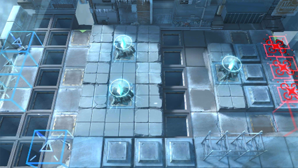

# 关卡一览————SA-6

## 关卡一览

关卡编号: SA-6

关卡名称: 福祸相依

目标点生命值: 3

敌人总数: 57

理智消耗: 18

## 关卡地图

## 敌人情况

| 敌人图片 | 敌人名称 | 数量  |
|---------|-----|-----|
| ./eneIcons/eneIcons/±ù±¬Ô´Ê¯³æ¡¤¦Á.png| 冰爆源石虫·α  |   10  |
| ./eneIcons/eneIcons/¿Õ½µ×鳤.png| 空降组长  |   6  |
| ./eneIcons/eneIcons/˪Èñ.png| 霜锐  |   12  |
| ./eneIcons/eneIcons/Ðé»Ã.png| 虚幻  |   10  |
| ./eneIcons/eneIcons/Ñ©¹ÖС¶Ó.png| 雪怪小队  |   5  |
| ./eneIcons/eneIcons/Ñ©¹ÖС¶ÓÆƱùÕß.png| 雪怪小队破冰者  |   3  |
| ./eneIcons/eneIcons/Ñý¹ÖMKII.png| 妖怪MKII  |   11  |
