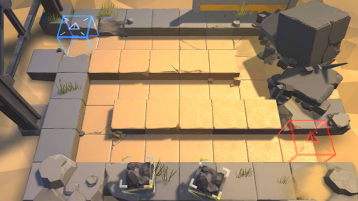

# 关卡一览————SK-1

## 关卡一览

关卡编号: SK-1

关卡名称: 废墟清剿

目标点生命值: 10

敌人总数: 22

理智消耗: 10

## 关卡地图

## 敌人情况

| 敌人图片 | 敌人名称 | 数量  |
|---------|-----|-----|
| ./eneIcons/eneIcons/»ú¶¯¶Ü±ø.png| 机动盾兵  |   5  |
| ./eneIcons/eneIcons/Ê¿±ø.png| 士兵  |   1  |
| ./eneIcons/eneIcons/Դʯ³æ.png| 源石虫  |   6  |
| ./eneIcons/eneIcons/Դʯ³æ¡¤¦Á.png| 源石虫·α  |   10  |
