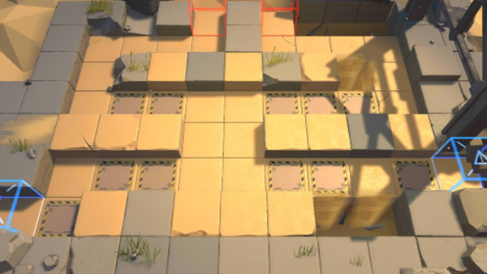

# 关卡一览————SK-5

## 关卡一览

关卡编号: SK-5

关卡名称: 要塞清剿

目标点生命值: 3

敌人总数: 49

理智消耗: 30

## 关卡地图

## 敌人情况

| 敌人图片 | 敌人名称 | 数量  |
|---------|-----|-----|
| ./eneIcons/eneIcons/·¨Êõ½üÎÀ×鳤.png| 法术近卫组长  |   11  |
| ./eneIcons/eneIcons/ÅÍз.png| 磐蟹  |   4  |
| ./eneIcons/eneIcons/Çá¼×ÎÀ±ø×鳤.png| 轻甲卫兵组长  |   18  |
| ./eneIcons/eneIcons/È­ÈÐÎäÊ¿×鳤.png| 拳刃武士组长  |   6  |
| ./eneIcons/eneIcons/Îä×°ÈËÔ±.png| 武装人员  |   4  |
| ./eneIcons/eneIcons/ÖØ×°·ÀÓù×鳤.png| 重装防御组长  |   6  |
