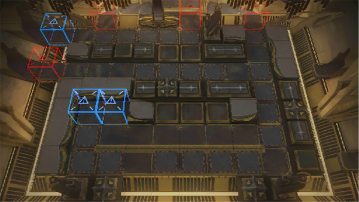

# 关卡一览————SN-10

## 关卡一览

关卡编号: SN-10

关卡名称: 礼仪广场

目标点生命值: 3

敌人总数: 64

理智消耗: 21

## 关卡地图

## 敌人情况

| 敌人图片 | 敌人名称 | 数量  |
|---------|-----|-----|
| ./eneIcons/eneIcons/µ×º£»¬¶¯Õß.png| 底海滑动者  |   18  |
| ./eneIcons/eneIcons/¿Çº£¿ñ±¼Õß.png| 壳海狂奔者  |   13  |
| ./eneIcons/eneIcons/Éîäé³²Ó¿Õß.png| 深溟巢涌者  |   2  |
| ./eneIcons/eneIcons/Éîäéµì»ùÕß.png| 深溟奠基者  |   5  |
| ./eneIcons/eneIcons/ÉîäéÁÔʳÕß.png| 深溟猎食者  |   10  |
| ./eneIcons/eneIcons/ÉîäéÁѽ¸Õß.png| 深溟裂礁者  |   1  |
| ./eneIcons/eneIcons/ÉîäéÅ罦Õß.png| 深溟喷溅者  |   7  |
| ./eneIcons/eneIcons/ÉîäéÒýºÛÕß.png| 深溟引痕者  |   1  |
| ./eneIcons/eneIcons/ÍÀÚÍÕߣ¬´óȺÒâÖ¾.png| 屠谕者，大群意志  |   1  |
| ./eneIcons/eneIcons/ÍËÐеij²Ó¿Õß.png| 退行的巢涌者  |   1  |
| ./eneIcons/eneIcons/ÍËÐеĵì»ùÕß.png| 退行的奠基者  |   1  |
| ./eneIcons/eneIcons/ÍËÐеÄÁÔʳÕß.png| 退行的猎食者  |   1  |
| ./eneIcons/eneIcons/ÍËÐеÄÁѽ¸Õß.png| 退行的裂礁者  |   1  |
| ./eneIcons/eneIcons/ÍËÐеÄÅ罦Õß.png| 退行的喷溅者  |   1  |
| ./eneIcons/eneIcons/ÍËÐеÄÒýºÛÕß.png| 退行的引痕者  |   1  |
