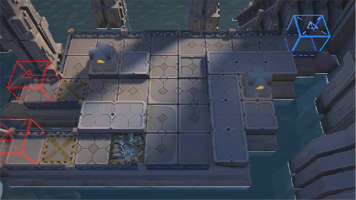

# 关卡一览————SN-3

## 关卡一览

关卡编号: SN-3

关卡名称: 安静的步道

目标点生命值: 3

敌人总数: 28

理智消耗: 9

## 关卡地图

## 敌人情况

| 敌人图片 | 敌人名称 | 数量  |
|---------|-----|-----|
| ./eneIcons/eneIcons/µ×º£»¬¶¯Õß.png| 底海滑动者  |   10  |
| ./eneIcons/eneIcons/¿Çº£¿ñ±¼Õß.png| 壳海狂奔者  |   11  |
| ./eneIcons/eneIcons/ÉîäéÁÔʳÕß.png| 深溟猎食者  |   3  |
| ./eneIcons/eneIcons/ÉîäéÅ罦Õß.png| 深溟喷溅者  |   4  |
