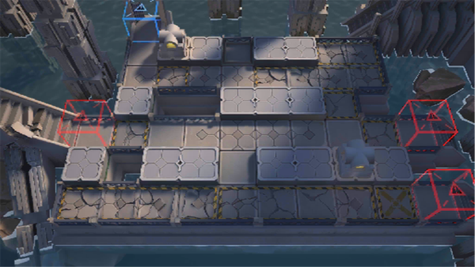

# 关卡一览————SN-5

## 关卡一览

关卡编号: SN-5

关卡名称: 灯塔控制室

目标点生命值: 3

敌人总数: 25

理智消耗: 12

## 关卡地图

## 敌人情况

| 敌人图片 | 敌人名称 | 数量  |
|---------|-----|-----|
| ./eneIcons/eneIcons/µ×º£»¬¶¯Õß.png| 底海滑动者  |   8  |
| ./eneIcons/eneIcons/¼¹º£ÅçÍÂÕß.png| 脊海喷吐者  |   4  |
| ./eneIcons/eneIcons/Éîäéµì»ùÕß.png| 深溟奠基者  |   10  |
| ./eneIcons/eneIcons/ÉîäéÅ罦Õß.png| 深溟喷溅者  |   3  |
