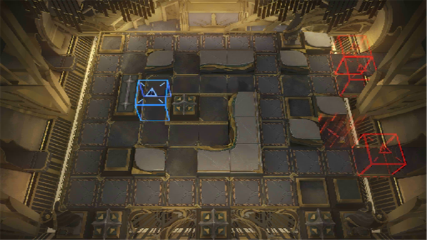

# 关卡一览————SN-6

## 关卡一览

关卡编号: SN-6

关卡名称: 中央通道

目标点生命值: 3

敌人总数: 30

理智消耗: 15

## 关卡地图

## 敌人情况

| 敌人图片 | 敌人名称 | 数量  |
|---------|-----|-----|
| ./eneIcons/eneIcons/¿Çº£¿ñ±¼Õß.png| 壳海狂奔者  |   18  |
| ./eneIcons/eneIcons/ÉîäéÁÔʳÕß.png| 深溟猎食者  |   10  |
| ./eneIcons/eneIcons/ÉîäéÒýºÛÕß.png| 深溟引痕者  |   2  |
