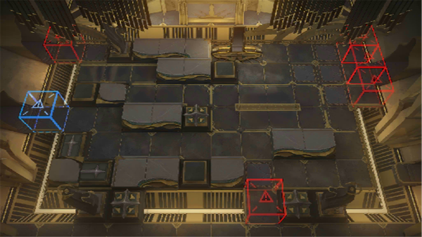

# 关卡一览————SN-8

## 关卡一览

关卡编号: SN-8

关卡名称: 观测所

目标点生命值: 3

敌人总数: 39

理智消耗: 21

## 关卡地图

## 敌人情况

| 敌人图片 | 敌人名称 | 数量  |
|---------|-----|-----|
| ./eneIcons/eneIcons/¼¹º£ÅçÍÂÕß.png| 脊海喷吐者  |   4  |
| ./eneIcons/eneIcons/¿Çº£¿ñ±¼Õß.png| 壳海狂奔者  |   24  |
| ./eneIcons/eneIcons/Éîäé³²Ó¿Õß.png| 深溟巢涌者  |   4  |
| ./eneIcons/eneIcons/ÉîäéÒýºÛÕß.png| 深溟引痕者  |   7  |
