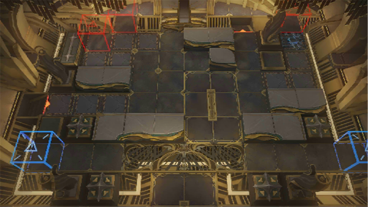

# 关卡一览————SN-9

## 关卡一览

关卡编号: SN-9

关卡名称: 信号灯组

目标点生命值: 3

敌人总数: 65

理智消耗: 21

## 关卡地图

## 敌人情况

| 敌人图片 | 敌人名称 | 数量  |
|---------|-----|-----|
| ./eneIcons/eneIcons/¿Çº£¿ñ±¼Õß.png| 壳海狂奔者  |   50  |
| ./eneIcons/eneIcons/Éîäé³²Ó¿Õß.png| 深溟巢涌者  |   1  |
| ./eneIcons/eneIcons/Éîäéµì»ùÕß.png| 深溟奠基者  |   4  |
| ./eneIcons/eneIcons/ÉîäéÁÔʳÕß.png| 深溟猎食者  |   8  |
| ./eneIcons/eneIcons/ÉîäéÁѽ¸Õß.png| 深溟裂礁者  |   2  |
