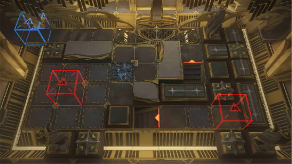

# 关卡一览————SN-EX-1

## 关卡一览

关卡编号: SN-EX-1

关卡名称: 初登陆

目标点生命值: 3

敌人总数: 62

理智消耗: 10

## 关卡地图

## 敌人情况

| 敌人图片 | 敌人名称 | 数量  |
|---------|-----|-----|
| ./eneIcons/eneIcons/¸»ÓªÑøµÄ»¬¶¯Õß.png| 富营养的滑动者  |   26  |
| ./eneIcons/eneIcons/¸»ÓªÑøµÄ¿ñ±¼Õß.png| 富营养的狂奔者  |   26  |
| ./eneIcons/eneIcons/¸»ÓªÑøµÄÁÔʳÕß.png| 富营养的猎食者  |   10  |
