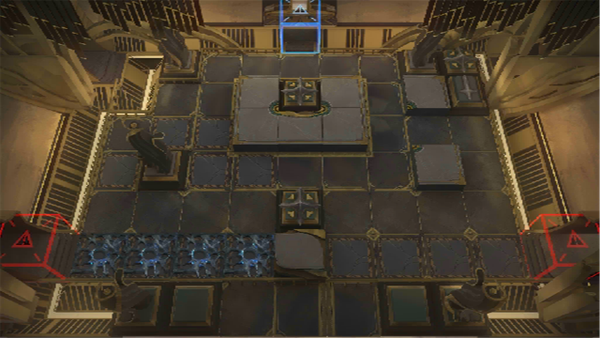

# 关卡一览————SN-EX-4

## 关卡一览

关卡编号: SN-EX-4

关卡名称: 堂皇宫殿

目标点生命值: 3

敌人总数: 39

理智消耗: 15

## 关卡地图

## 敌人情况

| 敌人图片 | 敌人名称 | 数量  |
|---------|-----|-----|
| ./eneIcons/eneIcons/¸»ÓªÑøµÄ³²Ó¿Õß.png| 富营养的巢涌者  |   2  |
| ./eneIcons/eneIcons/¸»ÓªÑøµÄ»¬¶¯Õß.png| 富营养的滑动者  |   25  |
| ./eneIcons/eneIcons/¸»ÓªÑøµÄÁÔʳÕß.png| 富营养的猎食者  |   7  |
| ./eneIcons/eneIcons/¸»ÓªÑøµÄÅ罦Õß.png| 富营养的喷溅者  |   5  |
