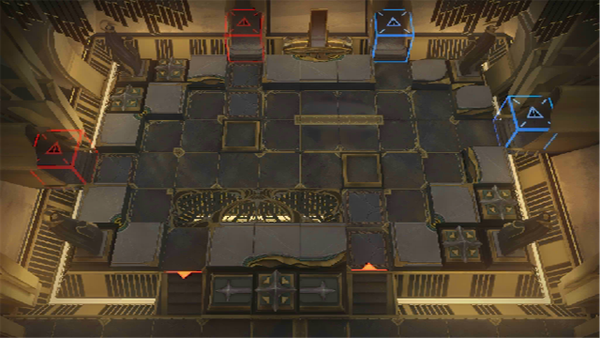

# 关卡一览————SN-EX-5

## 关卡一览

关卡编号: SN-EX-5

关卡名称: 愚人之船

目标点生命值: 3

敌人总数: 52

理智消耗: 15

## 关卡地图

## 敌人情况

| 敌人图片 | 敌人名称 | 数量  |
|---------|-----|-----|
| ./eneIcons/eneIcons/¸»ÓªÑøµÄ³²Ó¿Õß.png| 富营养的巢涌者  |   5  |
| ./eneIcons/eneIcons/¸»ÓªÑøµÄµì»ùÕß.png| 富营养的奠基者  |   3  |
| ./eneIcons/eneIcons/¸»ÓªÑøµÄ»¬¶¯Õß.png| 富营养的滑动者  |   27  |
| ./eneIcons/eneIcons/¸»ÓªÑøµÄÅçÍÂÕß.png| 富营养的喷吐者  |   13  |
| ./eneIcons/eneIcons/¸»ÓªÑøµÄÒýºÛÕß.png| 富营养的引痕者  |   4  |
