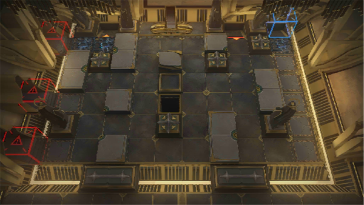

# 关卡一览————SN-EX-7

## 关卡一览

关卡编号: SN-EX-7

关卡名称: 伏波巨港

目标点生命值: 3

敌人总数: 62

理智消耗: 20

## 关卡地图

## 敌人情况

| 敌人图片 | 敌人名称 | 数量  |
|---------|-----|-----|
| ./eneIcons/eneIcons/¸»ÓªÑøµÄµì»ùÕß.png| 富营养的奠基者  |   4  |
| ./eneIcons/eneIcons/¸»ÓªÑøµÄ»¬¶¯Õß.png| 富营养的滑动者  |   38  |
| ./eneIcons/eneIcons/¸»ÓªÑøµÄÅ罦Õß.png| 富营养的喷溅者  |   7  |
| ./eneIcons/eneIcons/¸»ÓªÑøµÄÅçÍÂÕß.png| 富营养的喷吐者  |   11  |
| ./eneIcons/eneIcons/¸»ÓªÑøµÄÒýºÛÕß.png| 富营养的引痕者  |   2  |
