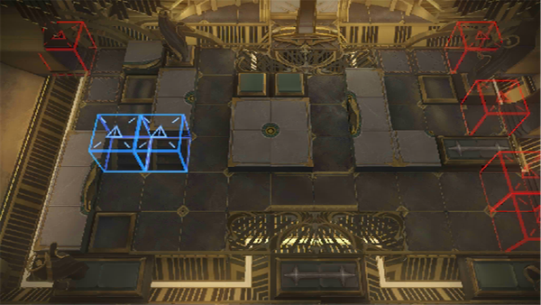

# 关卡一览————SN-EX-8

## 关卡一览

关卡编号: SN-EX-8

关卡名称: 静谧断章

目标点生命值: 3

敌人总数: 58

理智消耗: 20

## 关卡地图

## 敌人情况

| 敌人图片 | 敌人名称 | 数量  |
|---------|-----|-----|
| ./eneIcons/eneIcons/¸»ÓªÑøµÄ³²Ó¿Õß.png| 富营养的巢涌者  |   1  |
| ./eneIcons/eneIcons/¸»ÓªÑøµÄµì»ùÕß.png| 富营养的奠基者  |   3  |
| ./eneIcons/eneIcons/¸»ÓªÑøµÄ»¬¶¯Õß.png| 富营养的滑动者  |   14  |
| ./eneIcons/eneIcons/¸»ÓªÑøµÄ¿ñ±¼Õß.png| 富营养的狂奔者  |   4  |
| ./eneIcons/eneIcons/¸»ÓªÑøµÄÁÔʳÕß.png| 富营养的猎食者  |   19  |
| ./eneIcons/eneIcons/¸»ÓªÑøµÄÅ罦Õß.png| 富营养的喷溅者  |   4  |
| ./eneIcons/eneIcons/¸»ÓªÑøµÄÅçÍÂÕß.png| 富营养的喷吐者  |   3  |
| ./eneIcons/eneIcons/ÍÀÚÍÕߣ¬´óȺÒâÖ¾.png| 屠谕者，大群意志  |   1  |
| ./eneIcons/eneIcons/ÍËÐеij²Ó¿Õß.png| 退行的巢涌者  |   1  |
| ./eneIcons/eneIcons/ÍËÐеĵì»ùÕß.png| 退行的奠基者  |   1  |
| ./eneIcons/eneIcons/ÍËÐеÄÁÔʳÕß.png| 退行的猎食者  |   3  |
| ./eneIcons/eneIcons/ÍËÐеÄÁѽ¸Õß.png| 退行的裂礁者  |   1  |
| ./eneIcons/eneIcons/ÍËÐеÄÅ罦Õß.png| 退行的喷溅者  |   1  |
| ./eneIcons/eneIcons/ÍËÐеÄÒýºÛÕß.png| 退行的引痕者  |   2  |
