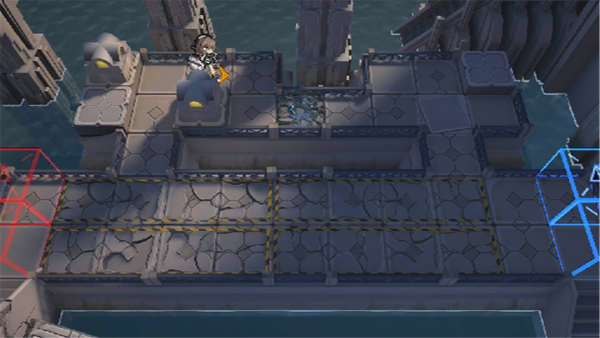

# 关卡一览————SN-TR-1

## 关卡一览

关卡编号: SN-TR-1

关卡名称: 惩戒军前线基地

目标点生命值: 3

敌人总数: 9

理智消耗: 0

## 关卡地图

## 敌人情况

| 敌人图片 | 敌人名称 | 数量  |
|---------|-----|-----|
| ./eneIcons/eneIcons/¿Çº£¿ñ±¼Õß.png| 壳海狂奔者  |   8  |
| ./eneIcons/eneIcons/ÉîäéÅ罦Õß.png| 深溟喷溅者  |   1  |
