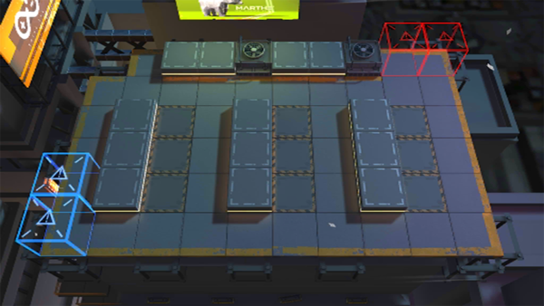

# 关卡一览————SV-1_四面埋伏

## 关卡一览

关卡编号: SV-1_四面埋伏

关卡名称: 四面埋伏

目标点生命值: 5

敌人总数: 72

理智消耗: 6

## 关卡地图

## 敌人情况

| 敌人图片 | 敌人名称 | 数量  |
|---------|-----|-----|
| ./eneIcons/eneIcons/±©Í½.png| 暴徒  |   14  |
| ./eneIcons/eneIcons/¹¤ÒÏ.png| 工蚁  |   8  |
| ./eneIcons/eneIcons/¿Õ½µ±ø.png| 空降兵  |   20  |
| ./eneIcons/eneIcons/¿Õ½µ×鳤.png| 空降组长  |   8  |
| ./eneIcons/eneIcons/Ñý¹ÖMKII.png| 妖怪MKII  |   20  |
| ./eneIcons/eneIcons/Óù4.png| 御4  |   2  |
