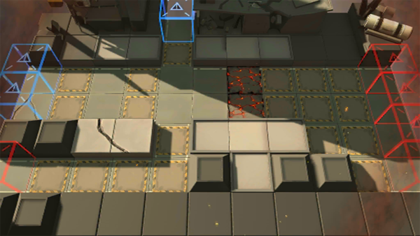

# 关卡一览————SV-3_浪潮

## 关卡一览

关卡编号: SV-3_浪潮

关卡名称: 浪潮

目标点生命值: 3

敌人总数: 56

理智消耗: 9

## 关卡地图

## 敌人情况

| 敌人图片 | 敌人名称 | 数量  |
|---------|-----|-----|
| ./eneIcons/eneIcons/·¨Êõ½üÎÀ.png| 法术近卫  |   9  |
| ./eneIcons/eneIcons/¸ßÄÜԴʯ³æ.png| 高能源石虫  |   28  |
| ./eneIcons/eneIcons/Èø¿¨×È´ó½£ÊÖ.png| 萨卡兹大剑手  |   3  |
| ./eneIcons/eneIcons/Èø¿¨×È´ó½£×鳤.png| 萨卡兹大剑组长  |   3  |
| ./eneIcons/eneIcons/Èø¿¨×Ⱦѻ÷ÊÖ.png| 萨卡兹狙击手  |   4  |
| ./eneIcons/eneIcons/Ë«³Ö½£Ê¿.png| 双持剑士  |   9  |
