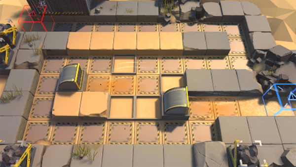

# 关卡一览————SV-4_百米冲刺

## 关卡一览

关卡编号: SV-4_百米冲刺

关卡名称: 百米冲刺

目标点生命值: 3

敌人总数: 67

理智消耗: 12

## 关卡地图

## 敌人情况

| 敌人图片 | 敌人名称 | 数量  |
|---------|-----|-----|
| ./eneIcons/eneIcons/ÁÔ¹·pro.png| 猎狗pro  |   7  |
| ./eneIcons/eneIcons/ÆÆÕóÕß.png| 破阵者  |   35  |
| ./eneIcons/eneIcons/ÆÛÁèÕß.png| 欺凌者  |   2  |
| ./eneIcons/eneIcons/Èø¿¨×È´©´ÌÊÖ.png| 萨卡兹穿刺手  |   8  |
| ./eneIcons/eneIcons/ÓÄÁé.png| 幽灵  |   15  |
