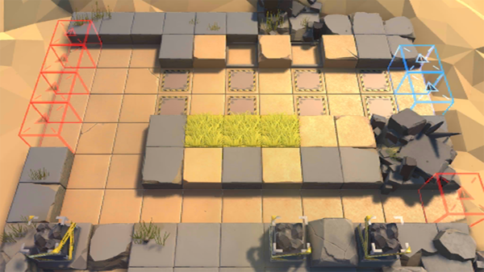

# 关卡一览————SV-5_突破口

## 关卡一览

关卡编号: SV-5_突破口

关卡名称: 突破口

目标点生命值: 3

敌人总数: 50

理智消耗: 15

## 关卡地图

## 敌人情况

| 敌人图片 | 敌人名称 | 数量  |
|---------|-----|-----|
| ./eneIcons/eneIcons/±¬Æƹ¥¼áÊÖ.png| 爆破攻坚手  |   1  |
| ./eneIcons/eneIcons/±¬Æƹ¥¼áÊÖ×鳤.png| 爆破攻坚手组长  |   2  |
| ./eneIcons/eneIcons/¸ß½×Êõʦ×鳤.png| 高阶术师组长  |   5  |
| ./eneIcons/eneIcons/¼¼ÊõÕì²ì±ø.png| 技术侦察兵  |   4  |
| ./eneIcons/eneIcons/ÁÔ¹·pro.png| 猎狗pro  |   12  |
| ./eneIcons/eneIcons/Èø¿¨×ȵ¶±ø.png| 萨卡兹刀兵  |   26  |
