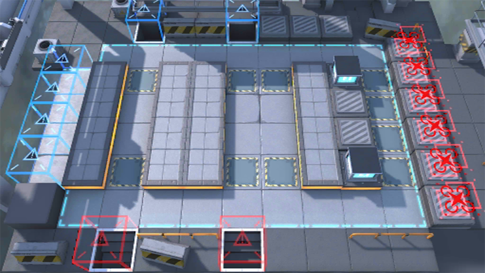

# 关卡一览————SV-7_空中来客

## 关卡一览

关卡编号: SV-7_空中来客

关卡名称: 空中来客

目标点生命值: 3

敌人总数: 74

理智消耗: 18

## 关卡地图

## 敌人情况

| 敌人图片 | 敌人名称 | 数量  |
|---------|-----|-----|
| ./eneIcons/eneIcons/±©û_¡¤G.png| 暴鸰·G  |   4  |
| ./eneIcons/eneIcons/·¨Êõ´óʦA1.png| 法术大师A1  |   16  |
| ./eneIcons/eneIcons/·¨Êõ´óʦA2.png| 法术大师A2  |   4  |
| ./eneIcons/eneIcons/·ÛËé¹¥¼á×鳤.png| 粉碎攻坚组长  |   2  |
| ./eneIcons/eneIcons/º®Ëª.png| 寒霜  |   4  |
| ./eneIcons/eneIcons/ËÞÖ÷Ê¿±ø×鳤.png| 宿主士兵组长  |   10  |
| ./eneIcons/eneIcons/Ñý¹ÖMKII.png| 妖怪MKII  |   32  |
| ./eneIcons/eneIcons/Óù4.png| 御4  |   2  |
