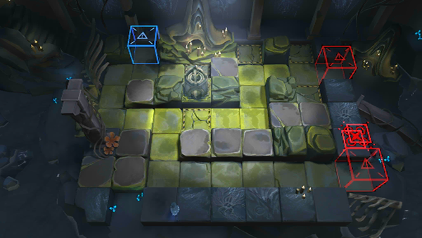

# 关卡一览————SV-8

## 关卡一览

关卡编号: SV-8

关卡名称: 亲族

目标点生命值: 3

敌人总数: 59

理智消耗: 18

## 关卡地图

## 敌人情况

| 敌人图片 | 敌人名称 | 数量  |
|---------|-----|-----|
| ./eneIcons/eneIcons/µ×º£»¬¶¯Õß.png| 底海滑动者  |   33  |
| ./eneIcons/eneIcons/¸¡º£Æ®º½Õß.png| 浮海飘航者  |   20  |
| ./eneIcons/eneIcons/ÄÒº£ÅÀÐÐÕß.png| 囊海爬行者  |   2  |
| ./eneIcons/eneIcons/Ê×ÑÔÕß.png| 首言者  |   1  |
| ./eneIcons/eneIcons/×Ô¶¯Î¬»¤»úÆ÷.png| 自动维护机器  |   3  |
