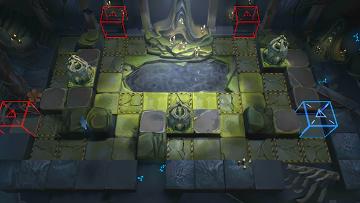

# 关卡一览————SV-9

## 关卡一览

关卡编号: SV-9

关卡名称: 笃信者

目标点生命值: 3

敌人总数: 44

理智消耗: 18

## 关卡地图

## 敌人情况

| 敌人图片 | 敌人名称 | 数量  |
|---------|-----|-----|
| ./eneIcons/eneIcons/¸¡º£Æ®º½Õß.png| 浮海飘航者  |   18  |
| ./eneIcons/eneIcons/¿Çº£¿ñ±¼Õß.png| 壳海狂奔者  |   16  |
| ./eneIcons/eneIcons/ʼº£´©´ÌÕß.png| 始海穿刺者  |   6  |
| ./eneIcons/eneIcons/ÑηçÖ÷½ÌÀ¥Í¼Ë¹.png| 盐风主教昆图斯  |   1  |
| ./eneIcons/eneIcons/×Ô¶¯Î¬»¤»úÆ÷.png| 自动维护机器  |   3  |
