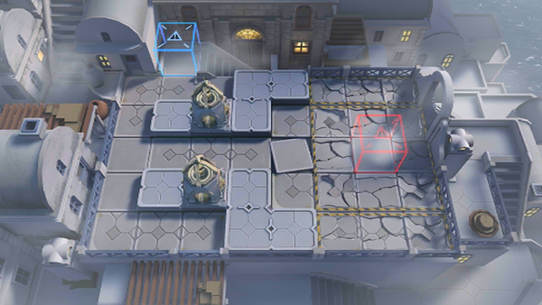

# 关卡一览————SV-EX-1

## 关卡一览

关卡编号: SV-EX-1

关卡名称: 喷涌而出

目标点生命值: 3

敌人总数: 76

理智消耗: 10

## 关卡地图

## 敌人情况

| 敌人图片 | 敌人名称 | 数量  |
|---------|-----|-----|
| ./eneIcons/eneIcons/µ×º£»¬¶¯Õß.png| 底海滑动者  |   31  |
| ./eneIcons/eneIcons/¸»ÓªÑøµÄ»¬¶¯Õß.png| 富营养的滑动者  |   31  |
| ./eneIcons/eneIcons/¸»ÓªÑøµÄ¿ñ±¼Õß.png| 富营养的狂奔者  |   4  |
| ./eneIcons/eneIcons/¿Çº£¿ñ±¼Õß.png| 壳海狂奔者  |   4  |
| ./eneIcons/eneIcons/ÄÒº£ÅÀÐÐÕß.png| 囊海爬行者  |   4  |
| ./eneIcons/eneIcons/×Ô¶¯Î¬»¤»úÆ÷.png| 自动维护机器  |   2  |
